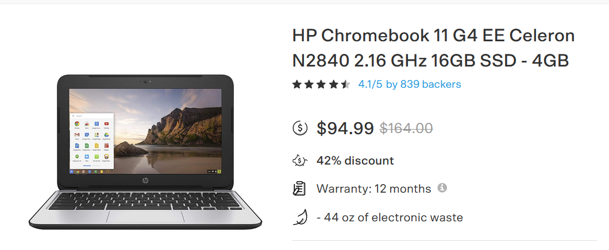

---
<u>DRAFT</u>
`DRAFT`

# Lidar in the CHS AWS Cloud


## Executive Summary

#### You really should be using the cloud.
- I can help you with all the details.
- Let's get started!

### Deliverables
- Visualizations
- Scalable Processing Pipelines for 
- A repository of very useful jupyter notebooks and libraries
- A refined, SMALL, list of winning technologies that accelerate science and cool decision fatigue fever.
- A model recipe, "HowTo/TL;DR" path for moving to the cloud - likely rapidly.

## Introduction

> The purpose of this effort 

> A secondary purpose is to promote the concept of shared science and shared data using the PANGEO reference architecture

> There are many tertiary goals for this project hinted at in the pages of this document/web-page.

This document is organized as follows:
1. not really organized at this point

**Disclaimer**
- `This document is a rough work-in-progress drafty draft`
- I expect to sand off some of the rough edges based on the actual facts from my colleagues

## Background

My name is Tony Butzer and I work with the Open Data Cube and PANGEO communities to help make science easy and fun.

I just completed 9 month project to move the EvapoTranspiration VegET model from on-prem desktops to the cloud.
This team was pleased with the performance improvements afforded by AWS S3. However; there is still much work to do on all of our parts to make the PANGEO experience useful to a broad class of scientific needs.

I want to build relationships with the science teams and help understand and fill any gaps in the PANGEO solution.

This LiDAR effort is one of many of my projects wanting to leverage the cloud without getting bogged down in the jargon and minutia.


## Scientists will rule the world

> For a few years now, I have been saying that compute is free for those who have a viable science model.

Most people look at me like I am crazy when I say this.


## Expected Audience 

The LiDAR Project Team

---
# Vision

- Demonstrate PANGEO and or CHS/AWS Architectures via practical science case studies; in this case LiDAR.

- Document AWS open source python tools for science

- Move LiDAR from personal "dark" repositories - to ubiquitous high perfromance cloud storage juxtiposed to compute.
	- Move the scietist to the data - not the data to some lithium battery powered laptop.


---
## Computers and Website

A compute/computer/ec2/instance in the cloud is the same as a computer in EROS's CR2!
- let me say that again
	- A computer in the cloud is the **SAME** as a computer in EROS's CR2!
	- linux is linux wherever it swims


## AWS Pangeo

- this work was spawned from the Open Data Cube work and sandbox/workshops - conducted here:
- https://tonybutzer.github.io/harmony-docs/


---

---
## Human Resources


### List for now - needs work


---
## github

- https://github.com/tonybutzer/ajit

- https://tonybutzer.github.io/ajit/

### Where are my assets?
### Makefiles and Dockerfiles


---

---
# Overview

- Project Initiation and Setup

- LiDAR exploration

- Infrastucture
	- S3 object storage - AWS
		- assessment
	- Compute
		- EC2 - AWS
		- pangeo.chs.usgs.gov - ??

- Cloud Differences

- Cloud Similarities

- Cloud Advantages

- Cloud Disadvantages

- Data Wrangling
	- ssh 
	- scp

- Project Specific Specialities
	- Collab vs. Jupyter/PANGEO
	- SageMaker and ML

---

### Science with a chromebook
. A used chromebook



---

- a chromebook and the right github repo is worth $200,000 a year.


## Instructors by Example
- Ryan Abernathey - PANGEO
- Chris Holmes - COGS and STAC
- Matt Hansen - STAC
- Scott Henderson - Landsat and Sentinel Jupyter Examples


## References

- https://lpdaac.usgs.gov/resources/e-learning/
- https://registry.opendata.aws/landsat-8/
- https://docs.opendata.aws/landsat-pds/readme.html
- https://corteva.github.io/rioxarray/stable/examples/clip_box.html
- https://corteva.github.io/rioxarray/stable/examples/convert_to_raster.html
- https://www.usgs.gov/core-science-systems/nli/landsat
- https://www.usgs.gov/core-science-systems/nli/landsat/landsat-collection-2


```
sponsors=['Pete Doucette', 'Doug Jaton', 'Steve LaBahn', 'Gabriel Senay']
my_class='Tonys Pangeo Useful School'

if 'Useful' in my_class:
	send_thankyou_email(sponsors)
else:
	pass
```
